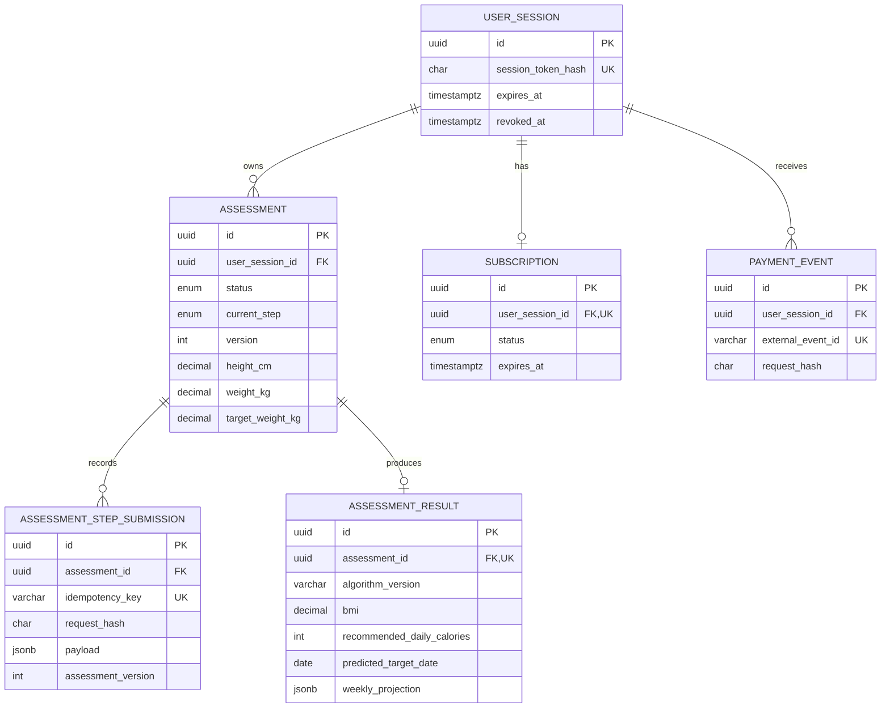

# Luma Health — assessment funnel

A production-shaped health-assessment funnel built for the Arkon/Ruiqi three-day full-stack challenge. It persists every step, resumes interrupted sessions, calculates results on the server, protects paid fields, and proves the critical paths with unit, PostgreSQL integration, and Playwright tests.

> This is general wellness estimation software, not medical advice or a diagnostic tool.

## Deliverables

- Live demo: **pending deployment credentials**
- Source repository: [Heathcliff-1104/health-assessment-challenge](https://github.com/Heathcliff-1104/health-assessment-challenge)
- Paid comparison session: **generated after production deployment**
- API contract: [`docs/api.md`](docs/api.md)
- Database ER diagram: [`docs/schema.mmd`](docs/schema.mmd)
- AI collaboration retrospective: [`docs/ai-retrospective.md`](docs/ai-retrospective.md)
- Requirement-by-requirement checklist: [`docs/delivery-checklist.md`](docs/delivery-checklist.md)
- CI: [`.github/workflows/ci.yml`](.github/workflows/ci.yml)

## Architecture at a glance

```text
Next.js client
    │ HTTP + HttpOnly anonymous-session cookie
    ▼
Route handlers ── validation / error envelope / no-store
    ▼
Application services ── ordering / optimistic locking / idempotency / access policy
    ▼
Domain ── strict input rules / deterministic health calculation
    ▼
Prisma 7 + PostgreSQL ── typed columns / checks / unique constraints / audit records
```

The anonymous token is returned once and stored in an HttpOnly, SameSite=Lax cookie. Only its SHA-256 hash is persisted. Assessment ownership is checked on every protected request. `If-Match` carries the assessment version, while `Idempotency-Key` makes step writes and simulated payment callbacks replay-safe.

### Data model



Typed assessment columns make validation and analytics reliable; JSONB is restricted to immutable request audit payloads and the variable-length projection. A partial unique index guarantees one in-progress assessment per session. PostgreSQL checks protect numeric ranges even when data bypasses the API.

## Run locally

Requirements: Node.js 20.9+ and PostgreSQL 14+.

```bash
npm ci
cp .env.example .env
# edit DATABASE_URL and DIRECT_URL
npm run prisma:deploy
npm run dev
```

Open `http://localhost:3000`. `DATABASE_URL` may be a pooled runtime URL; `DIRECT_URL` should be a direct connection used by Prisma migrations.

## Quality commands

```bash
npm run lint
npm run typecheck
npm test
npm run test:coverage
npm run build
```

Database integration tests activate only when `TEST_DATABASE_URL` is set, so a unit-only local run needs no database. To explicitly run the real persistence suite:

```bash
TEST_DATABASE_URL="$DATABASE_URL" npm run test:integration
```

End-to-end tests require a migrated test database:

```bash
npx playwright install chromium
npm run test:e2e
```

GitHub Actions provisions PostgreSQL 16 and runs migrations, lint, types, coverage, production build, and the desktop/mobile Chromium funnel. No test silently substitutes an in-memory database for persistence behavior.

### Covered scenarios

- Algorithm: BMI category thresholds, calorie floors/caps, goal-specific adjustments, deterministic target dates and projection endpoints, and property-based invariants.
- Validation: missing/unknown fields, strings instead of numbers, null/array/NaN/infinity, min/max age-height-weight, inconsistent goals, >50% change, and unsupported target BMI.
- Persistence: incremental writes, interruption/resume, out-of-order submissions, identical replay, idempotency-key misuse, and two concurrent writes using the same version.
- Access: preview DTO excludes every protected field; active unexpired membership returns the full DTO; inactive/expired membership does not.
- Payment: incomplete-assessment rejection, callback idempotency, state activation, and preview-to-full end-to-end transition.
- Browser: five-step funnel, reload recovery, server validation UX, preview response leakage check, demo payment, and unlocked projection on desktop and mobile Chromium.

Not currently covered: real payment-provider signatures/retries (the brief explicitly asks for a mock), accessibility automation beyond semantic Playwright selectors, non-Chromium browser projects, visual-regression snapshots, and sustained load testing. These are the next additions for a production launch.

## Health calculation

Algorithm version `health-v1` uses BMI plus Mifflin–St Jeor-style basal energy estimation, an activity multiplier, and conservative goal adjustments. Calories are clamped to configured general-wellness floors and a 4,500 kcal ceiling. Target rates are gradual and deterministic; the complete input and calculated result are persisted together in a transaction.

The non-binary/prefer-not-to-say offset is a neutral midpoint estimate. This is an explicit product compromise, shown with a health disclaimer, rather than presented as clinical precision.

## Result access boundary

Preview and full results are separate allow-list DTO constructors. A non-member response includes BMI, category, copy, and the names of locked fields. It never serializes BMR, TDEE, calorie target, target date, or weekly projection. Membership requires both `ACTIVE` status and a future expiry.

## Replay the mock payment

Complete an assessment first. Use either the HttpOnly cookie from the browser or the bearer token returned by `POST /api/v1/sessions`:

```bash
curl -X POST "$BASE_URL/pay" \
  -H "Authorization: Bearer $SESSION_TOKEN" \
  -H "Content-Type: application/json" \
  -H "Idempotency-Key: reviewer-payment-0001" \
  -d '{"planCode":"demo_monthly"}'
```

Replay the exact command to verify idempotency. No card is charged; the subscription becomes active for 30 days.

## Deployment

Recommended setup: Vercel for Next.js and Neon or Supabase PostgreSQL. Configure `DATABASE_URL` and `DIRECT_URL`, run `npm run prisma:deploy` against production, then deploy. Health data and demo access tokens must not be committed as environment files.

The three current `npm audit` findings all trace to `deepmerge-ts` under the development-time Prisma CLI/config package; application runtime code imports `@prisma/client`, not that CLI path. npm still reports the lockfile chain when asked to omit dev dependencies. Force-fixing proposes downgrading Prisma across a major version and would break the generated-client architecture, so the alert is documented and monitored rather than hidden with an unsafe downgrade.

## Key trade-offs

- Anonymous sessions meet the brief with minimal friction; production account linking can attach an authenticated user without changing assessment ownership.
- Optimistic locking gives explicit `409 VERSION_CONFLICT` semantics across serverless instances. A last-write-wins update would silently lose answers.
- Step audit rows make retries explainable and support future funnel analytics. The current typed row remains fast to restore.
- `/pay` and `/api/v1/pay` share one handler: the former matches the brief, while the versioned path keeps the API namespace consistent.
